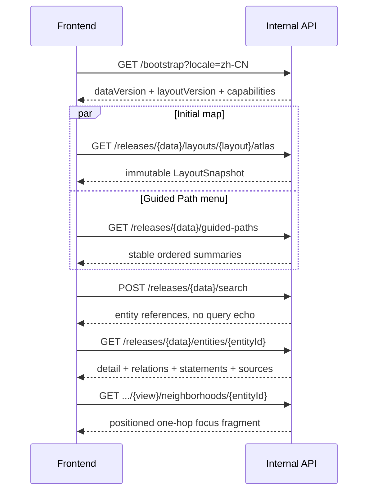

# SeekStar TechMap 前后端 API 契约 v1

| 字段 | 值 |
| --- | --- |
| 状态 | **冻结，规范性内部契约** |
| 契约版本 | `1.0.0` |
| 路径主版本 | `/api/internal/v1` |
| 机器真源 | [`contracts/internal-api/v1/openapi.yaml`](../contracts/internal-api/v1/openapi.yaml) |
| 日期 | 2026-07-19 |
| 适用范围 | Alpha Web 前端与产品后端之间的数据交换 |
| 对外承诺 | **无，不是未来公共 API** |

> [!IMPORTANT]
> OpenAPI 文件是字段、类型、必填性、枚举、端点和状态码的唯一机器真源。本文冻结无法仅靠 Schema 完整表达的语义、组合顺序、缓存、隐私、兼容和性能规则。两者冲突时必须停止实现并修复契约，不允许前后端各自选择一种解释。

采用 [OpenAPI 3.1.1](https://spec.openapis.org/oas/v3.1.1.html) 和 [JSON Schema Draft 2020-12](https://json-schema.org/draft/2020-12)。选择 3.1.1 是当前内部契约的明确版本决定，不随规范新版本自动升级。

## 1. 契约目标

这份契约使前端和后端可以在没有对方实现的情况下并行开发：

- 前端只依赖 OpenAPI 生成的类型和 Client；当前阶段不以 Mock 响应作为开发前置条件。
- 后端只依赖 OpenAPI 的请求、响应与真实 Provider Contract Tests。
- 双方都不得从数据库表、编辑 YAML 或 React 组件反推另一套接口。
- 任何技术实现可以替换，只要继续满足同一契约、性能和语义。

“解耦”指实现解耦，不代表产品语义解耦。永久 ID、关系方向、时间精度、布局版本和证据状态仍然是两端共享的业务语言。

## 2. 非目标

本契约不是：

- 公共开发者 API。
- MCP 服务。
- `techmap-data` 编辑 Schema 的镜像。
- PostgreSQL 表或 SQL 查询的远程暴露。
- 通用 GraphQL、任意图遍历或任意字段查询接口。
- 前端相机、Three.js Object3D 或 Zustand Store 的序列化格式。
- 账户、收藏、个人历史或 Advisor 的预留接口。

未来公共 `/v1` REST/OpenAPI 和 MCP 必须单独设计，不能直接把 `/api/internal/v1` 改名后发布。

## 3. 边界责任

### 3.1 后端负责

- 校验并消费已发布的 `techmap-data` 版本。
- 将事实图谱投影成产品任务需要的响应。
- 生成或读取已审核的确定性布局快照。
- 保证永久 ID、关系方向、Statement 与 Source 完整性。
- 搜索排序、slug 迁移、游标和本地化回退。
- ETag、缓存、压缩、限流和一致的错误响应。
- 在返回前验证响应符合当前 OpenAPI 契约。

### 3.2 前端负责

- 从 `/bootstrap` 获取当前发布版本，并在一次页面生命周期中固定使用该版本。
- 使用生成 Client，不手写重复 DTO。
- 按规范顺序组合基础布局、时代展开、叠层和聚焦邻域。
- 将 API 的 Z 向上语义坐标转换到具体渲染器坐标。
- 维护视图、焦点、年份、筛选、叠层和 Guided Path 等客户端语义状态。
- 对 Markdown、外部 URL 和资源加载执行前端安全处理。
- 根据错误码执行降级、重试或用户提示，不解析错误文案做逻辑判断。

### 3.3 契约不负责

- 后端如何存储图谱或运行布局算法。
- 前端如何组织组件、状态库或渲染对象。
- CI、部署和数据库迁移的内部格式。
- 数据编辑工作流的候选字段。

## 4. 版本体系

系统存在四个互不替代的版本：

| 版本 | 例子 | 含义 |
| --- | --- | --- |
| 契约版本 | `1.0.0` | 请求和响应结构及其语义 |
| 路径主版本 | `/api/internal/v1` | 允许同一服务并存的不兼容契约代际 |
| 数据版本 | `1.0.0-alpha.1` | 图谱事实与内容发布 |
| 布局版本 | `1.0.0-alpha.1` | 对某数据版本审核通过的空间投影 |

数据内容另有 `sha256:` 内容哈希。后端不得返回数据版本正确但哈希不匹配的响应。

### 4.1 启动固定版本

一次前端页面生命周期必须遵循：

1. 请求 `/bootstrap?locale=...`。
2. 读取 `dataVersion`、`dataHash` 和 `layoutVersion`。
3. 后续请求全部使用返回的精确版本路径。
4. 不得在同一地图状态中混用另一次 Bootstrap 的版本。
5. 检测到新 Bootstrap 时只提示刷新或在安全边界重新初始化，不热拼接新旧快照。

### 4.2 不可变资源

所有 `/releases/{dataVersion}/...` 响应对相同路径、查询、locale 和请求体必须确定。布局、详情、来源和路径一旦发布不得原地修改。修正通过新数据版本或布局版本发布。

## 5. 正常加载序列



首屏不得等待组织、人物、论文、生命周期叠层或全部实体详情。它们按用户操作加载。

## 6. 端点清单

| 方法与路径 | 用途 | 缓存 |
| --- | --- | --- |
| `GET /bootstrap` | 当前数据、布局、能力和十二根领域 | 60 秒并重验证 |
| `GET /releases/{data}/layouts/{layout}/{view}` | Atlas、Stack 或 Time 基础布局 | 永久不可变 |
| `GET .../{view}/overlays/{overlay}` | 组织、人物、论文或生命周期叠层 | 永久不可变 |
| `GET .../{view}/expansions/{entityId}` | 语义时代展开片段 | 永久不可变 |
| `GET .../{view}/neighborhoods/{entityId}` | 聚焦节点的一跳局部关系 | 永久不可变 |
| `POST /releases/{data}/search` | 不进入 URL 日志的搜索 | `no-store` |
| `GET /releases/{data}/entities/{entityId}` | 详情、关系、事件、Statement 与来源 | 永久不可变 |
| `GET /releases/{data}/sources/{sourceId}` | 单一规范化来源 | 永久不可变 |
| `GET /releases/{data}/resolve/{kind}/{slug}` | typed route 的 slug 解析与迁移 | 永久不可变 |
| `GET /releases/{data}/guided-paths` | Guided Path 列表 | 永久不可变 |
| `GET /releases/{data}/guided-paths/{pathId}` | 完整 Guided Path | 永久不可变 |
| `POST /telemetry/events` | 匿名白名单事件批次 | `no-store` |

Alpha 不使用 WebSocket、Server-Sent Events、GraphQL 或通用批处理端点。

## 7. Bootstrap 契约

Bootstrap 是唯一会随当前发布变化的读取资源。它必须包含：

- 精确契约、数据、数据 Schema 与布局版本。
- 数据内容哈希、发布时间和审核时间。
- CC BY 4.0 许可及归属入口。
- 支持的 locale、三视图、四叠层和三条 Guided Path ID。
- 搜索、邻域和遥测的硬上限。
- 十二个固定根领域及稳定排序。

Bootstrap 不是远程功能开关平台。不得通过它悄悄加入 PRD 排除的 Advisor、账户、Benchmark 或公共 API 能力。

Bootstrap 的 `ETag` 必须对应 locale 后的完整响应。前端可以使用 `If-None-Match`，`304` 不返回正文。

## 8. 知识投影

### 8.1 EntityReference 与 EntityMapSummary

`EntityReference` 是详情和关系中的轻引用；`EntityMapSummary` 是地图、搜索和邻域需要的最小可展示实体。两者都使用永久 ID，不使用 slug 作为关联键。

`resourceKind` 只服务 typed route：

| `Entity.type` | `resourceKind` |
| --- | --- |
| `domain` | `domain` |
| `organization` | `org` |
| `person` | `person` |
| `paper` | `paper` |
| 其余类型 | `tech` |

`canonicalName` 始终是英文正式名；`displayName` 与 `summary` 按请求 locale 投影。品牌名可以在中文响应中保持英文。

### 8.2 EntityDetail

详情响应一次返回：

- 实体显示字段、别名和 CommonMark 长说明。
- 主容器和其他分类。
- 生命周期与复核状态。
- 完整语义关系、关键事件和语义时代。
- 当前详情引用的 Statement 与 Source。
- 官方链接、讨论和预填纠错 URL。

后端必须保证响应内所有 `statementIds` 和 `sourceIds` 可解析。前端不得为了渲染一个详情页发起逐关系 N+1 请求。

`descriptionMarkdown` 禁止原始 HTML。前端仍必须使用安全 Markdown 渲染策略，不能信任字符串已经适合直接插入 DOM。

### 8.3 关系

关系始终携带原始 `source` 和 `target`，不随当前焦点倒置。`symmetric=true` 只用于允许双向展示的关系，不能修改数据方向。

核心关系使用冻结枚举。领域扩展只能使用 `ext.{domain}.v{major}.{predicate}`。前端遇到认识之外但符合扩展格式的关系时，使用通用关系样式与服务端 `displayLabel`，不得丢弃整个响应。

### 8.4 时间

时间使用 `TemporalValue`，其 `precision` 与 `start`/`end` 是事实的一部分：

- `year` 只能提供年份。
- `month` 可以提供年、月。
- `day` 可以提供完整日期。
- `circa` 表示约数，显示时不得移除“约”语义。
- `range` 必须有起止范围。
- `unknown` 的 `start` 和 `end` 为 `null`。

前端不得用 `1970-01-01`、当月第一天或其他占位值补齐精度。

### 8.5 Null、缺失与空集合

契约 v1 使用以下固定规则：

- Schema 标记 `required` 的字段必须始终出现，即使值允许为 `null`。
- `null` 表示此字段在当前语义下无值、未知或不适用，具体含义由字段说明确定。
- 空数组表示该集合已经完整加载且没有成员。
- 缺失字段只允许发生在 Schema 明确未列为 required 的属性中。
- 前端不得把 `null`、空字符串、零和空数组互相替代。
- 所有对象默认拒绝未声明属性；扩展关系类型是唯一预先开放的本体扩展点。

## 9. 搜索契约

搜索固定使用 POST。原因是搜索正文如果位于 URL query，容易进入反向代理、CDN、浏览器历史和访问日志。

固定语义：

- `query` 为 1 至 120 个 Unicode 字符。
- `locale` 必填。
- 类型和根领域过滤数组为空表示不过滤。
- 每页最多 50 条，默认 20 条。
- `cursor` 是不透明字符串，只对完全相同的数据版本、query、locale、过滤和 limit 有效。
- 排序依次考虑正式名精确匹配、显示名、别名、缩写、拼音、前缀、子串和 trigram。
- `match.kind` 只表达搜索相关性，不代表趋势、质量或推荐分。
- `match.displayText` 是命中的实体文本，`highlightRanges` 使用相对该文本的 Unicode code point 半开区间。
- `total` 只有在 `totalIsExact=true` 时保证为精确整数；否则可以为 `null`。
- 响应不得回显搜索正文。
- 搜索请求正文不得进入应用日志、Trace、分析事件或错误详情。

请求是安全且幂等的，但响应固定为 `Cache-Control: no-store`。

## 10. 布局契约

### 10.1 语义坐标

API 使用右手坐标系：

- X/Y 是水平面。
- Z 是产品语义的垂直轴。
- 单位是无物理含义的 `layout_unit`。

Atlas 的 Z 只表示浅浮雕；Stack 的 Z 表示抽象层；Time 的 Z 表示年代。Three.js 默认坐标习惯不属于 API，前端适配层负责映射，业务组件不得自行交换轴。

### 10.2 基础快照

`LayoutSnapshot` 是不可变基础：

- `regions` 提供审核后的包络、标题保留区和颜色 Token。
- `nodes` 提供默认可见实体、位置、占地与标签规则。
- `landmarkEdges` 只包含远景允许显示的策划关系。
- `strata` 在 Stack 中提供抽象层带，在其他视图可以为空。
- `lodBands` 使用 0 至 1 的 `semanticZoom`，不直接绑定 Three.js 相机距离。
- `canonicalCamera` 和 `cameraConstraints` 定义标准构图，不进入分享 URL。
- `timeScale` 在 Time 中给出年份与 Z 的映射及主刻度；Atlas、Stack 中为 `null`。

Stack 的 `strata` 必须非空而 `timeScale` 为 `null`；Time 的 `timeScale` 必须非空；Atlas 两者都不承担垂直事实。该视图条件由语义契约测试验证。

前端不得重新计算或随机调整正式节点位置，也不得通过文字测量反向改变区域尺寸。

### 10.3 组合顺序

地图按以下顺序组合：

1. 基础 `LayoutSnapshot`。
2. 最多一个活动的 `LayoutExpansion`。
3. 零至多个 `LayoutOverlay`，按 `organizations`、`people`、`papers`、`lifecycle` 固定顺序。
4. 当前 `LayoutNeighborhood` 的关系强调。
5. 前端瞬时 Hover、选中和动画状态。

同一数据版本和布局版本的片段才能组合。`baseSnapshotId` 不一致时必须拒绝组合并重新 Bootstrap。

### 10.4 时代展开

Alpha 同一时刻最多展开一个主技术的语义时代。展开片段：

- 可以新增 era 节点和时代关系。
- 可以完整替换受影响区域的包络。
- 不得移动或替换任何基础节点。
- 折叠时直接丢弃片段并恢复基础区域。

实体没有语义时代或当前视图无法展开时返回 `409 expansion_not_supported`，不返回空成功对象。

### 10.5 叠层

组织、人物和论文叠层只增加节点与关系；生命周期叠层主要增加带 Statement 的状态注记。叠层不得移动基础节点、改变区域包络或覆盖事实字段。

关闭叠层只移除该叠层的数据，不触发基础布局重新加载。

### 10.6 聚焦邻域

邻域固定为一跳，不提供任意深度参数。请求可以限制关系类型、相对焦点的方向和最多 80 条边。

当关系超过上限时，后端按照地标等级、核心关系优先级和稳定 ID 做确定性裁剪，并返回 `truncated=true` 与 `totalAvailable`。前端必须显示“仅展示部分关系”，不得让用户误以为数据完整。

## 11. Slug 与可索引路由

前端路由使用 `/zh/tech/{slug}`、`/zh/org/{slug}` 等 typed route，但内部关联始终使用永久 ID。

Resolver 返回以下状态：

- `canonical`：当前 slug，无需重定向。
- `redirected`：历史 slug，前端执行永久重定向到 `canonicalPath`。
- `merged`：原实体已合并，重定向到替代实体并保留旧 ID 记录。
- `tombstoned`：实体已撤销且无替代，显示解释页，不复用 ID 或 slug。

未知 slug 返回 `404`；已知但对应数据版本不再保留时可以返回 `410`。

## 12. Guided Path

列表按 `sortOrder` 稳定排序。完整路径由有序步骤构成，每一步包含：

- 聚焦实体永久 ID。
- 与前一步的正式关系 ID。
- 本地化标题和解释。
- 推荐视图、聚焦模式、关系类型、叠层和可选年份。

路径只能引用同一数据版本中存在的 Entity、Relation 和 Statement。前端不得在组件中复制路径事实。

## 13. HTTP、缓存与传输

### 13.1 Headers

成功响应返回：

- `X-Request-Id`
- `X-TechMap-Contract-Version`
- `X-TechMap-Data-Version`，如适用
- `X-TechMap-Layout-Version`，如适用
- `ETag`，对可缓存读取资源
- 明确的 `Cache-Control`

版本化资源使用强 ETag。locale 是表示的一部分，因此不同 locale 必须产生不同 ETag。

OpenAPI 只声明生产规范地址。开发、测试和预览环境通过生成 Client 的 Base URL 配置注入，不把 `localhost` 或临时域名写入冻结契约。

### 13.2 缓存

- Bootstrap：`public, max-age=60, stale-while-revalidate=300`。
- 精确版本资源：`public, max-age=31536000, immutable`。
- 搜索、遥测与错误：`no-store`。
- `304` 不返回正文。

### 13.3 压缩

服务器必须为支持的客户端提供 Brotli 或 gzip。大小预算以压缩后的响应正文计算：

| 资源 | 压缩后预算 |
| --- | ---: |
| Bootstrap | 64 KiB |
| 单个基础布局 | 1 MiB |
| 单个叠层 | 512 KiB |
| 单个时代展开 | 256 KiB |
| 单个邻域 | 256 KiB |
| 单个实体详情 | 128 KiB |
| Guided Path 列表或单条路径 | 128 KiB |

超出预算必须通过数据投影、重复字段消除或资源拆分解决，不能让前端绕过类型契约读取私有压缩格式。是否采用 HTTP/2 或 HTTP/3 不改变 JSON 语义。

### 13.4 超时与重试

前端建议超时：

- Bootstrap 和搜索：5 秒。
- 布局：10 秒。
- 详情、来源、叠层、展开和邻域：6 秒。
- 遥测：2 秒且不阻塞用户操作。

只对网络失败、`429` 和 `503` 自动重试。遵守 `Retry-After`，最多两次指数退避。`400`、`404`、`409`、`410` 和 `413` 不自动重试。

## 14. 错误契约

错误使用 `application/problem+json`，业务逻辑只读取稳定的 `code`，不读取本地化 `title` 或 `detail`。

| 状态 | 含义 |
| --- | --- |
| `400` | 参数、游标、locale 或请求结构不合法 |
| `404` | 当前发布中从未存在该资源 |
| `409` | 实体存在，但不支持当前布局展开 |
| `410` | 已知发布或资源不再保留 |
| `413` | 搜索或遥测超过长度/批次/字节上限 |
| `429` | 匿名滥用保护限流 |
| `500` | 未预期内部错误，不暴露堆栈 |
| `503` | 当前无法提供内部一致的数据发布 |

错误正文必须含 `requestId`。参数错误通过 `invalidParameters` 指向 path、query、header 或 body。错误详情不得包含 SQL、文件路径、堆栈、搜索正文或其他请求正文。

## 15. 排序与确定性

除非字段另有说明，服务端返回数组必须使用稳定排序：

- 根领域使用 `sortOrder`。
- Guided Path 与步骤使用 `sortOrder`/`order`。
- 事件按时间升序、未知时间最后、永久 ID 破同分。
- 关系按核心关系词表顺序、对端地标等级、显示名和永久 ID。
- 来源按 primary source、来源类型、发布时间和永久 ID。
- 布局元素按 `sortOrder` 或永久 ID。

同一版本的分页和裁剪结果必须稳定。数据库自然顺序不属于契约。

## 16. 匿名遥测

遥测 Schema 是封闭白名单，不允许任意属性对象。请求不得包含：

- 搜索正文或匹配文本。
- Entity ID、Source ID 或访问 URL。
- 用户 ID、账户 ID、设备指纹或 Session ID。
- 完整相机轨迹。
- 自由文本错误消息。

允许发送固定枚举、粗粒度设备类别、渲染后端、视图、实体类型、根领域、Guided Path ID、耗时桶和数量桶。

后端必须：

- 在日志和 Trace 层禁用遥测正文记录。
- 不持久化来源 IP 或 User-Agent 到分析数据。
- 在 24 小时内聚合并删除原始事件。
- 只保留不能还原个人访问序列的聚合结果。

遥测失败不得影响地图操作或触发用户可见错误。

## 17. 安全约束

- Alpha 内容 API 无登录和 Cookie 鉴权，默认同源访问。
- 不因无登录而允许任意跨域滥用；生产 CORS 只允许产品域名和批准的预览域名。
- 所有 path、query、header 和 body 在进入业务逻辑前按 OpenAPI 校验。
- 响应也必须在测试和非生产环境执行 Schema 校验。
- 外部 URL 只允许 `https`，开发环境例外不进入数据发布。
- CommonMark 禁止原始 HTML，渲染时清洗链接协议和属性。
- Logo 与其他资源必须来自批准的资产源，不允许运行时加载任意数据 URL。
- 限流只用于匿名滥用保护，不建立长期访客标识。

## 18. 生成与真实 Provider 契约测试

机器契约必须产生以下派生物，但派生物不得手工修改：

- 前端 TypeScript 类型和 API Client。
- 后端 Fastify 请求/响应校验类型。
- 本机真实 Fastify Provider，连接真实 PostgreSQL 测试数据库。
- OpenAPI 文档预览。
- Provider 与 Consumer Contract Test 输入。

未来根工作区应提供：

```text
pnpm contract:lint
pnpm contract:breaking
pnpm contract:test
```

最低 CI 顺序：

1. 解析并 lint OpenAPI。
2. 解析全部本地 `$ref`。
3. 用 Schema 验证内嵌示例。
4. 与上一个契约版本执行 breaking-change 检查。
5. 生成 Client 与 Server 类型，并验证无未提交差异。
6. 后端测试对本机真实 Fastify Provider 运行。
7. 后端 Provider Tests 对真实服务运行。
8. 对响应头、缓存、压缩、错误和大小预算执行协议测试。

不得创建永远成功的占位脚本，也不得以 TypeScript 能编译代替运行时响应验证。

## 19. 兼容规则

`contracts/internal-api/v1/openapi.yaml` 的 `1.0.0` 发布后不可原地改写语义。后续变化遵循：

- 文案、注释或修正无效示例，不改变验证结果：Patch。
- 新增真正可选且旧客户端可以忽略的字段或端点：Minor。
- 修改字段类型、必填性、null 语义、枚举、ID、关系方向、排序、状态码或现有字段含义：Breaking。
- 删除或重命名字段、端点：Breaking。
- 为封闭枚举新增值默认按 Breaking 处理。
- 新增符合 `ext.*` 规则的扩展关系不升级 API major，但需要数据版本升级。

Breaking 变化必须：

1. 建立决策记录。
2. 说明前端、后端、真实 Provider、缓存和旧部署影响。
3. 发布新路径主版本或提供明确的双版本迁移期。
4. 在删除旧版本前验证生产客户端已迁移。

内部契约稳定不等于公共兼容承诺。未来公开 API 可以采用完全不同的资源形状。

## 20. 完成标准

前后端开始功能实现前，契约基础设施必须证明：

- OpenAPI 可以被标准 3.1 工具解析。
- 全部 `$ref` 可解析且无循环导致的生成失败。
- Schema 对请求、成功响应和 Problem Details 都生效。
- Bootstrap、三种 Layout、搜索、React 详情、slug 迁移、Guided Path、时代展开、四类叠层和遥测都有有效 Fixture。
- 真实本机 Provider 能在没有前端的情况下完成全部契约流程。
- 后端空实现可以针对同一 Provider Tests 得到明确失败项。
- 搜索正文不会进入 URL、日志、Trace 或遥测。
- 版本与 ETag 混用会被测试发现。
- 压缩后响应满足大小预算。

当前实施阶段先完成真实本机 Provider，不创建 Mock Server 或前端。业务代码和 PostgreSQL 适配完成后，才统一建立并执行真实 Provider 契约测试。
