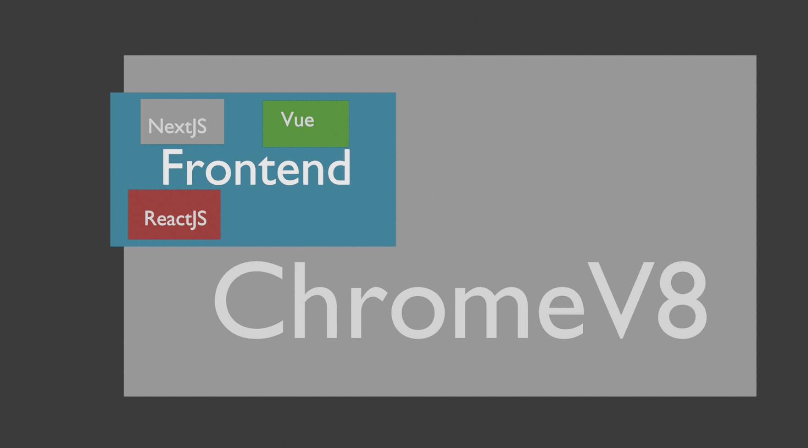
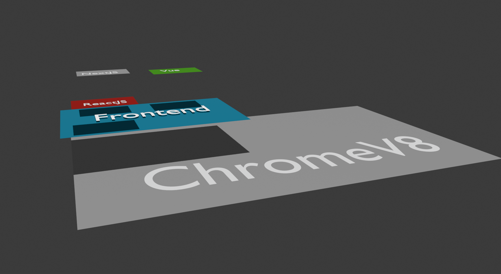

# SeekStar TechMap 产品规划 v0.1

> [!IMPORTANT]
> 本文是**非规范背景草案**，不作为设计、数据或工程实施依据。规范性产品真源见 [SeekStar TechMap PRD v1.0](./PRD.zh-CN.md)。

> 状态：产品定义草案  
> 日期：2026-07-19  
> 建议产品名：**SeekStar TechMap**  
> 建议中文名：**技术地图**  
> 建议域名：**techmap.seekstar.ai**





## 1. 结论

这个产品值得做，但成立的前提不是“做一个很酷的 3D 页面”，而是做成一套可信、稳定、可演化的软件技术世界模型。

最准确的一句话定义是：

> **SeekStar TechMap 是一张可探索、可验证、也可被 Agent 读取的软件技术世界地图。它让人看见技术属于哪里、建立在什么之上、能与什么组合、可被什么替代，以及它们如何随时间演化。**

核心产品是技术关系图谱及其空间表达。技术选型、AI 问答、提示词、MCP 和模型 Benchmark 都是这份结构化知识自然长出来的能力，不应反过来定义产品。

如果最终只是技术卡片目录加聊天框，没有必要做；如果能建立稳定的空间语法、严谨的关系模型和可追溯的数据治理，它会成为很有辨识度的基础设施。

## 2. 产品机会

现有产品分别解决了相邻问题，但没有完全覆盖这个产品的核心命题：

| 产品 | 主要回答的问题 | 与 TechMap 的边界 |
| --- | --- | --- |
| [roadmap.sh](https://roadmap.sh/about) | 为某个角色或技能，下一步应该学什么 | 学习路径为中心，通常不是整个技术世界的统一空间模型 |
| [StackShare](https://stackshare.io/about) | 某公司用了什么，两个工具如何比较 | 使用与选型为中心，不突出基础关系、抽象层和历史演化 |
| [CNCF Landscape](https://github.com/cncf/landscape) | 云原生生态中有哪些项目和产品 | 单一领域的分类景观，关系类型与时间表达较弱 |
| [Thoughtworks Technology Radar](https://www.thoughtworks.com/radar) | 某项技术目前值得采用、试用还是关注吗 | 有明确观点和周期快照，不是技术依赖与组成关系百科 |
| **SeekStar TechMap** | 整个软件技术世界如何彼此构成 | 以关系、空间、层级和演化为核心，决策功能为附加层 |

真正的差异化不是“3D”，而是以下四点同时成立：

1. **全局景观**：先让用户看到自己身处技术世界的什么位置。
2. **多关系图谱**：不把所有关系粗暴压成一棵分类树。
3. **多视图投影**：同一份事实可以按领域、抽象层或时间重新组织。
4. **可验证知识**：重要事实有来源、时间范围、版本和审核状态。

## 3. 产品定位与边界

### 3.1 核心定位

TechMap 首先是一个“3D 技术百科”和“软件技术图谱浏览器”。第一屏就应该是可操作的地图，而不是营销落地页、问卷或 AI 对话框。

用户进入后，最先感受到的应该是：

- 原来软件世界由这些大区域构成。
- 原来我熟悉的技术只处于其中一小块。
- 原来一个产品从底层到上层要经过这些层次。
- 原来两个看似同级的名称，实际可能是依赖、运行时、替代或生态关系。
- 原来一项技术在历史上经历过这些关键变化。

### 3.2 不是这些产品

- 不是另一个“最值得学的十大框架”列表。
- 不是默认替用户做决定的技术顾问。
- 不是由模型临时生成、每次形状都不同的知识图。
- 不是单纯追求节点数量的 Logo 墙。
- 不是把 Benchmark 排名放在首页的模型榜单。
- 不是以厂商付费决定地理位置和视觉层级的广告地图。

### 3.3 品牌建议

**推荐正式使用 `SeekStar TechMap`，产品内简称 `TechMap`，中文称“技术地图”。**

`techmap.seekstar.ai` 很合适：清晰、可理解，也能借 `SeekStar` 降低 `TechMap` 这个通用名称带来的混淆。公开传播时不要只写裸的 `TechMap`，因为已有多个教育、咨询和地图类产品使用近似名称。正式发布前仍应做一次商标与品牌检索。

不建议把主产品叫“科技树”。“树”天然暗示单一父节点、先修顺序和线性成长，而这个产品实际上是多父级、多关系、可循环的图。“科技树”可以保留为未来的学习路径功能名称。

建议品牌文案：

- 中文：**看见技术如何彼此构成。**
- 英文：**See how technology fits together.**
- 较完整的英文描述：**An explorable atlas of the software world.**

## 4. 目标用户与核心任务

### 4.1 首要用户

**Vibe coder 与刚开始独立构建产品的人。**

他们不一定需要先成为某个技术专家，但需要知道一个完整产品通常涉及界面、运行时、服务端、数据、部署、安全和 AI 等不同层面，并知道每一层有哪些可选路线。

### 4.2 次要用户

- 想跨到陌生领域的在职开发者。
- 需要建立完整技术认知的新人与学生。
- 需要解释技术关系的教师、作者和 DevRel。
- 需要快速研究生态、替代方案和演化过程的架构师与产品人员。
- 通过 API 或 MCP 消费结构化技术知识的 Agent 与开发工具。

### 4.3 用户要完成的任务

1. **定位**：某项技术位于什么领域和抽象层。
2. **理解**：它是什么，解决什么问题，建立在什么之上。
3. **关联**：它与上下游、替代品、配套技术和运行平台是什么关系。
4. **探索**：从一个已知技术出发，发现邻近但陌生的选择。
5. **回溯**：查看技术何时出现、何时成熟、何时废弃或被替代。
6. **构建路径**：从“我要做什么”反推出一条可落地的技术组合。
7. **验证 AI 能力**：查看模型在特定技术与版本上的真实完成度。

## 5. 产品结构

建议把产品分成一个核心与四个附加层：

### 核心：Tech Atlas

可探索的 3D 技术地图、技术详情、关系与历史。这是首页，也是产品存在的理由。

### 附加层 A：Guided Paths

面向新人的引导路线，例如“一个 Web 产品从浏览器到数据库”“一个本地 AI 应用由哪些层组成”。它是在地图上高亮路径，不是另做一套课程网站。

### 附加层 B：Knowledge API / MCP

让 IDE、Agent 和其他产品读取同一份结构化知识。它是图谱的接口，不是独立维护的第二份知识库。

### 附加层 C：Advisor

根据目标、设备、部署方式、团队能力和已有工具提出技术组合，并在地图上解释选择路径。建议明确区分“图谱中的事实”和“模型给出的建议”。

### 附加层 D：Benchmark

用版本化、可执行的测试案例评估模型对各项技术的掌握程度，并把结果作为地图的一个可选热力图层和独立页面。

## 6. 三种核心视图

这里最重要的原则是：

> **一种坐标轴在同一个视图中只表达一种主要语义。**

“抽象层级”和“发布时间”不能同时稳定地占用 Z 轴。否则 C++、V8、JVM、React 和 Next.js 的高度既要代表建立关系，又要代表年份，任何一边都不会准确。因此三种视图应该是同一知识图谱的三种空间投影，而不只是转动相机。

### 6.1 地图模式 Atlas

这是默认主视图，接近俯视地图。

- X/Y 表示技术领域、语义邻近度和生态边界。
- 父级领域显示为可扩张的地块或包络面。
- 子领域与技术节点位于父级边界内。
- Z 只承担轻微视觉分层，不承载精确时间含义。
- 用户重点感知“在哪里”和“附近有什么”。

典型问题：

- React 在整个软件世界的什么位置？
- 除了 Vue，还有哪些邻近方案？
- Web UI 区域与桌面 UI、移动 UI、图形渲染是什么关系？

### 6.2 地层模式 Stack

这是侧视或斜视的技术构成视图。

- Z 表示执行依赖或抽象层，从硬件、系统、运行时逐渐到框架、应用方案和产品。
- 关系边重点显示 `runs_on`、`built_on`、`compiles_to` 和 `implements`。
- 某些技术会跨层，而不是被强迫塞进唯一高度。
- 父级领域可以表现为半透明体积或纵向边界，而不是只存在于某一个高度的薄片。

典型路径：

`硬件 -> 操作系统 -> 运行时/引擎 -> 语言 -> 库/框架 -> 应用方案 -> 产品`

这条路径只是视觉语法，不意味着所有技术都严格经过每一层。例如原生语言、解释型语言、数据库和云服务会形成不同的分支。

### 6.3 时间模式 Time

这是技术演化视图。

- Z 或独立时间轴表示时间。
- X/Y 尽量继承地图模式的位置，保留用户的空间记忆。
- 时间滑杆可以回看某一年当时存在的技术景观。
- 类别显示为跨越时间的半透明体积，技术节点在关键事件处出现、变化或淡出。
- 重点显示 `first_public_release`、`stable_release`、`renamed`、`deprecated`、`eol` 等事件。

时间模式不应该只用一个“发布日期”。例如 CUDA 在 2006 年被提出，公开工具链和后续版本还有不同时间点；这些是不同事件。

### 6.4 路径聚焦不是第四张地图

“从目标到方案”“从一个技术追踪上下游”更适合成为三种视图上的聚焦状态：弱化无关区域，高亮选定关系链，并允许用户逐步展开。这样不会产生第四套难以维护的坐标体系。

## 7. 核心交互

### 7.1 首页

- 首屏直接进入全屏地图。
- 顶部提供搜索、视图切换、筛选和分享当前视图。
- 搜索结果应把镜头带到技术所在位置，而不是把用户带离地图。
- 初次使用可以提供一个很短的可跳过引导，但不先要求填写问卷。

### 7.2 技术节点

点击技术后打开侧边详情面板，建议包括：

- 一句话定义。
- 所属领域和当前地图位置。
- 解决的问题与常见用途。
- 建立在什么之上、运行在哪里。
- 常见替代项与配套项。
- 关键历史事件和当前生命周期。
- 支持的平台、语言和设备。
- 官方文档、仓库与事实来源。
- 最后审核时间与存在争议的说明。

### 7.3 关系探索

- 悬停只显示最重要的少量关系。
- 点击“关系”后再展开完整邻居，避免默认视图成为线团。
- 关系必须有方向、类型和图例。
- 用户可只看“依赖”“替代”“运行环境”“历史”等某一类关系。
- 当前聚焦状态应有 URL，可分享和复现。

### 7.4 细节层级 LOD

- 远距离只显示大领域与少量地标技术。
- 中距离显示子领域、重要技术和主要连接。
- 近距离才显示完整标签、次级技术与更多关系。
- 文本优先保持屏幕空间可读，不把所有文字烘焙到 3D 网格中。
- 移动端默认采用受控的 2.5D 俯视体验，并保留搜索与路径聚焦。

## 8. 知识模型

### 8.1 不能用一棵树表达真实世界

视觉布局需要一个近似树形的“主归属”，但知识本身必须是图。

以草图中的对象为例：

- React 与 Vue 可以在 Web UI 区域中作为相邻技术。
- Next.js 不是与 React 完全同级的替代物。它建立在 React 上，同时覆盖前端与服务端能力。
- Next.js 可以在视觉上以“React 生态”为主归属，但同时通过关系进入“全栈 Web”“服务端渲染”“Node.js 运行时”等多个语境。
- “Frontend 属于 GUI，GUI 属于图形学”只能作为某一种观察方式，不能成为唯一真理。UI、图形渲染、Web 平台和应用开发之间更适合用多类关系连接。

因此应严格区分：

- **`primary_parent`**：只用于决定地图中的主要摆放位置。
- **语义关系**：描述真实的分类、依赖、运行、替代和历史关系。

一个对象只能有一个主要摆放位置，但可以有任意多个语义关系。地图中的桥梁和边用于表达跨区域身份，不复制事实对象。

### 8.2 一等对象

建议知识模型至少包含以下对象：

| 对象 | 说明 |
| --- | --- |
| `Entity` | 技术、概念、标准、语言、运行时、库、框架、数据库、工具、平台、服务或产品 |
| `Domain` | 用于组织地图的领域和子领域，本身也是可解释对象 |
| `Relation` | 两个对象之间带类型、方向、语境和时间范围的关系 |
| `Event` | 发布、改名、收购、弃用、归档、结束支持等时间事件 |
| `Source` | 官方文档、发布记录、仓库、标准文本或经过审核的二级来源 |
| `Statement` | 带证据的最小事实陈述，用于把来源绑定到具体事实而非整张卡片 |
| `LayoutSnapshot` | 某个数据版本在特定视图和层级下的确定性布局结果 |
| `BenchmarkCase` | 与技术及版本关联的测试案例定义 |
| `BenchmarkRun` | 某模型、工具配置和时间下的一次可复现测试结果 |

`Entity` 建议具有稳定 ID，并提供多语言名称、别名、实体类型、生命周期状态、主要摆放父级和外部标识。技术更名时不要更换稳定 ID。

### 8.3 第一版关系词表

第一版不宜无限增加关系。建议先稳定以下集合：

| 关系 | 含义 |
| --- | --- |
| `is_a` | 是某种更一般的技术或概念 |
| `member_of` | 属于某个领域或生态 |
| `built_on` | 主要建立在另一技术之上 |
| `runs_on` | 运行于某个运行时、平台、系统或设备 |
| `compiles_to` | 编译或转换为另一目标 |
| `implements` | 实现某个标准、协议或概念 |
| `targets` | 主要面向某平台、设备或场景 |
| `integrates_with` | 存在常见且明确的集成关系 |
| `alternative_to` | 在指定问题和语境下可作为替代方案 |
| `complements` | 常被搭配使用，但不存在直接依赖 |
| `successor_to` | 明确的继任关系 |
| `inspired_by` | 有来源支持的设计影响关系 |
| `maintained_by` | 主要维护组织 |
| `used_for` | 常见用途或能力领域 |

`alternative_to` 必须带语境。例如 PostgreSQL 与 SQLite 只在部分本地存储场景中可比较，不能被记录为无条件等价替代。

### 8.4 时间不是一个字段

不要只给对象一个 `released_at`。建议用事件表达生命周期：

- `announced`
- `first_public_release`
- `stable_release`
- `major_release`
- `renamed`
- `ownership_changed`
- `deprecated`
- `archived`
- `end_of_support`

每个事件应记录日期、日期精度、来源和说明。只有年份可确认时，就保留“年”精度，不伪造具体日期。

关系本身也有时间。例如某个平台从一个版本开始支持某项技术，或某框架在后续版本更换默认构建器，都需要 `valid_from`、`valid_to` 或版本范围。

一个很好的校验例子是：TensorFlow 官方资料给出的开源日期是 2015-11-09；PyTorch 官方 2018-01-19 的“一周年”文章说明其公开发布在 2017 年，而不是把文章年份直接当作发布日期。这说明“事件类型 + 来源”比裸年份可靠。

### 8.5 事实、观点与建议分层

- **事实层**：Next.js 建立在 React 上，有官方来源。
- **统计层**：某技术的活跃度、使用量、版本频率，由公开数据计算。
- **编辑观点层**：成熟度、学习难度、适合场景，必须说明方法和更新时间。
- **个性化建议层**：结合用户约束得出的推荐，应展示假设、理由与替代项。

这四层不能混成一个“AI 结论”。

## 9. 动态布局与卡片包络

用户提出的“父卡片根据子对象自动扩张，直到刚好放下并为标题留出位置”，本质上是**层级复合图布局**，不是普通 3D 模型摆放。

### 9.1 基本原则

- 内容数据不手写最终宽高和坐标。
- 布局结果也不应在用户每次打开页面时随机重算。
- 数据是事实，布局是可重新生成、可版本化的派生产物。
- 父级尺寸由子级布局结果自底向上推导。
- 用户筛选通常只隐藏对象，不让整张地图立刻重新洗牌。
- 新增节点尽量只影响所属子树，并保留既有地标位置。

### 9.2 建议布局流程

1. **确定主要归属树**：从完整图中抽取仅用于空间放置的 `primary_parent` 树。
2. **测量叶节点占地**：根据图标、短名称、重要度和当前 LOD 得到最小占地，而不是按子节点数量粗算。
3. **预留父级标题区**：每个区域有独立标题带、安全内边距和关系边出口区。
4. **排列同级子节点**：使用矩形装箱、稳定网格或约束布局，让高关联对象尽量相邻。
5. **反推父级边界**：取全部子节点包围盒，加标题区、内边距和未来扩张余量。
6. **递归向上计算**：直到根地图的全部区域得到尺寸。
7. **优化跨区邻接**：根据重要关系权重调整大区域相对位置，减少长距离交叉边。
8. **固定锚点并产出快照**：保存数据版本、算法版本、坐标和边界，供客户端直接加载。
9. **运行时处理标签碰撞**：根据镜头和缩放，在屏幕空间决定标签显隐、偏移和优先级。

父级尺寸可以自动生成，但地图必须保持“地理记忆”。因此推荐离线或构建期确定性布局，浏览器负责渲染、视图变换和小范围过渡，不在每次访问时运行自由力导向模拟。

### 9.3 可采用的布局能力

[Eclipse Layout Kernel](https://eclipse.dev/elk/) 已支持层级节点；其 Layered 算法也支持带跨层边的 compound graph。它适合处理依赖方向和部分复合关系，但 TechMap 的区域地图仍需要自己的“矩形包络 + 稳定地理位置”规则。更合适的方案是混合布局，而不是期待单一算法一次生成最终地图：

- 区域内部使用稳定装箱或约束布局。
- 有方向的依赖链使用分层布局。
- 跨区域关系单独路由。
- 最终坐标经过编辑审阅并缓存为 `LayoutSnapshot`。

### 9.4 草图对应的改进

草图已经验证了“父区域包络子技术”和“侧视揭示层级”这两个方向。正式设计中建议进一步约束：

- 子节点默认不得越出父级边界，除非明确表现为跨域桥接。
- 父标题拥有稳定的保留区域，不与子卡片争夺空间。
- 文字作为独立显示层处理，避免贴面文字在斜视时失真或遮挡。
- 大区域不依靠一块无限放大的平板表达，可使用轮廓、浅高度地形和分级边界。
- 跨领域对象只有一个“家”，其他身份通过连线、边界桥或聚焦投影表达。

## 10. 内容卡片与知识片段模板

每项技术建议使用统一的知识片段结构：

1. **一句话定义**：它是什么，而不是营销口号。
2. **地图位置**：主要领域、邻近区域、抽象层。
3. **解决的问题**：它为何存在。
4. **建立与运行关系**：`built_on`、`runs_on`、`compiles_to`。
5. **适用场景**：什么条件下通常合适。
6. **不适用场景**：典型代价和边界。
7. **替代与配套**：必须注明比较语境。
8. **时间线**：首次公开、稳定版、重大转折、弃用或归档。
9. **平台与设备**：Web、桌面、移动、服务端、边缘、嵌入式等。
10. **学习入口**：官方文档、最小示例、必要先修概念。
11. **来源与审核**：事实来源、最后审核日期和争议说明。

长教程和完整文档不应直接塞进 3D 卡片。地图提供方向，详情页提供上下文，外部官方资料提供深度。

## 11. “Vibe Coder 第一课”

这不应该做成离开地图的传统课程，而应该是一条可播放、可跳转的引导路径：

1. 先从“你想做什么”选择结果类型，例如网站、桌面工具、移动应用、游戏、数据产品或 AI 应用。
2. 地图依次高亮界面、逻辑、运行时、数据、部署和运维等必要层面。
3. 每一层先解释“这一层解决什么”，再展示几个代表性选项。
4. 用户选择约束，例如离线、本地优先、低成本、跨平台、团队语言和目标设备。
5. 地图显示一条候选技术路径，同时保留分叉和替代项。
6. 最后生成可交给编码 Agent 的结构化技术简报。

建议的方案请求模板：

```text
目标产品：
目标用户与使用频率：
目标设备与平台：
是否需要离线：
数据规模与实时性：
部署环境与预算：
已有语言、框架与团队能力：
正在使用的 AI 模型或编码工具：
必须满足的约束：

请基于 TechMap 的可验证关系：
1. 给出 2 至 3 条候选技术路径；
2. 逐层说明每项选择解决的问题；
3. 标出依赖、替代项、风险和不确定信息；
4. 区分事实依据与针对当前目标的建议；
5. 附上对应技术节点与来源。
```

## 12. 后端与数据维护建议

### 12.1 第一阶段不必先上专用图数据库

建议把可审阅性放在查询炫技之前：

- **编辑源数据**：Git 中版本化的 YAML 或 JSON，方便审阅、PR 和历史追踪。
- **运行数据**：PostgreSQL 保存实体、关系、事件、来源、声明和布局快照。
- **搜索**：先使用结构化筛选与全文搜索，语义向量检索后置。
- **图数据库**：只有在复杂多跳查询、规模和性能已经证明需要时再引入。

专用图数据库不能替代本体设计。即使使用 Neo4j 或其他图存储，如果 `built_on`、`member_of` 和 `alternative_to` 的含义没有被定义清楚，数据仍然不可用。

### 12.2 数据流水线

建议形成以下单向流程：

`编辑数据 -> Schema 校验 -> 关系与来源校验 -> 派生布局 -> 人工视觉审核 -> 发布快照 -> API/MCP/网站共同读取`

AI 可以帮助发现候选条目、抽取发布日期和生成摘要，但不能未经审核直接写入正式图谱。

### 12.3 多语言

稳定 ID、关系类型和外部标识使用语言无关形式；名称、描述、别名和知识片段按 locale 存储。这样可以先做中文内容，同时不需要未来为英文版重建数据结构。

## 13. API 与 MCP

先建立稳定的公开读取 API，再把同一能力包装为 MCP。MCP 本身已经区分 Resources、Tools 与 Prompts，TechMap 可以自然映射：

### Resources

- `techmap://technology/{id}`
- `techmap://domain/{id}`
- `techmap://technology/{id}/timeline`
- `techmap://technology/{id}/evidence`
- `techmap://benchmark/{model}/{technology}`

### Tools

- `search_technologies`
- `get_technology`
- `get_neighbors`
- `trace_stack`
- `find_technology_paths`
- `compare_technologies`
- `find_options_for_goal`
- `get_benchmark_results`

### Prompts

- 解释某项技术在全局地图中的位置。
- 从目标生成候选技术路径。
- 比较两项技术在指定约束下的取舍。
- 为编码 Agent 生成带来源的技术上下文包。

第一版 MCP 应以只读知识查询为主。官方 MCP 说明中，Resources 用于提供结构化上下文，Tools 用于模型主动查询或执行操作；TechMap 没有必要把每个静态事实都包装成一个“AI 工具”。

推荐首期使用同域路径 `techmap.seekstar.ai/api` 与 `techmap.seekstar.ai/mcp`，等独立运维需求出现后再拆分更多子域名。

## 14. Benchmark 产品规划

Benchmark 很有价值，因为它能把“某模型擅长 React”从印象变成可重复证据。但它应该是第二阶段以后建立的独立测量系统，而不是 TechMap 的核心定义。

### 14.1 要测的不是一个模糊总分

建议分成三条赛道：

1. **Closed-book Knowledge**：不给外部文档，测模型已有知识及版本准确度。
2. **Docs-grounded**：提供指定版本官方文档，测检索、理解和约束遵循。
3. **Agentic Build**：提供仓库、终端和测试环境，测能否真正构建、修复和验证。

这三条分数不能混在一起。模型知识、检索系统、Agent 工具和脚手架都会影响结果。

### 14.2 测试案例结构

每个案例至少应绑定：

- 技术与明确版本。
- 案例创建和最后审核日期。
- 任务说明与初始项目夹具。
- 允许的文档、工具和联网条件。
- 模型标识、API 日期、推理设置、token 与时间预算。
- 可执行的公开测试与保留测试。
- 构建环境、依赖锁文件和容器镜像。
- 成功条件、部分得分规则与失败分类。

### 14.3 案例类型

- 最小功能实现。
- 正确使用特定版本 API。
- 多技术集成。
- 迁移与弃用 API 修复。
- 调试真实错误。
- 性能、安全、可访问性或平台约束。
- 文档中容易混淆的边界行为。

### 14.4 评分维度

- 构建与测试通过率。
- API 和版本正确性。
- 需求约束完成度。
- 回归、安全与可访问性。
- 多次运行稳定性。
- 完成时间、token 和 API 成本。
- 是否引用了错误版本或虚构能力。

### 14.5 更新节奏

- **每月完整榜单**：运行稳定案例集，适合形成月报。
- **新模型事件测试**：新模型发布时运行代表性子集。
- **每周冒烟测试**：只测少量高变化技术，不宣称为完整排名。

每个模型和案例建议至少重复运行 3 次，并公开聚合方法。案例要持续加入新版本和新问题，降低训练数据污染。可以公开方法、环境和一部分案例，同时保留轮换测试。

[SWE-bench](https://github.com/SWE-bench/SWE-bench) 证明了使用真实仓库和可执行测试评估软件任务的价值；[LiveCodeBench](https://livecodebench.github.io/pdfs/paper.pdf) 强调了时间切分和污染问题。TechMap Benchmark 的独特点应是**按技术与版本切片**，而不是再造一个只有总分的编码榜单。

### 14.6 与地图结合

- 技术节点可以显示“已覆盖多少案例”，而不是默认显示模型广告。
- 选择某个模型后，以热力层显示它在不同技术区域的得分和置信度。
- 数据不足的区域应明确显示“样本不足”，不能用缺失值推断模型能力。
- 推荐系统只有在目标技术拥有足够、近期且可比的案例时，才能使用 Benchmark 作为依据。

用户日常使用的模型或编码工具可以成为方案评估中的“实施风险”因子，但不能成为技术适用性的主排序。正确顺序应当是先根据产品目标与约束得到候选技术，再叠加模型能力。如果最合适的技术恰好不是当前模型的强项，系统还应提供“换用更合适的模型”“启用指定版本文档”或“选择团队更熟悉的次优方案”，而不是为了迎合模型直接扭曲技术选择。

## 15. 内容治理

知识图谱的可信度会比渲染技术更难，也更有长期价值。

### 15.1 来源优先级

1. 官方文档、标准、发布日志和官方仓库。
2. 基金会、维护组织和经过同行评审的论文。
3. 高质量二级资料，用于解释而非替代关键事实来源。
4. 社区提交，进入审核队列后才可发布。

### 15.2 审核状态

每条重要事实建议拥有以下状态之一：

- `draft`
- `source_checked`
- `expert_reviewed`
- `disputed`
- `stale`

### 15.3 更新机制

- 每个节点显示最后审核时间。
- 官方 Release、仓库归档和文档变化可以触发候选更新。
- 自动化只生成变更建议，不直接覆盖人工确认的事实。
- 高流量、高变化和高关系度节点优先审核。
- 争议分类允许记录编辑说明，而不是悄悄移动节点。

### 15.4 商业产品与赞助

商业服务可以进入地图，但应满足清晰的技术相关性与来源标准。赞助不得购买更大的地块、更高的 Z 轴或更靠近核心技术的位置。商业标识、推荐和事实数据必须视觉分离，否则地图会失去信任。

## 16. MVP 范围

第一版不要试图穷举整个计算机世界。推荐先做一个能同时验证横向生态与纵向技术栈的“完整切片”。

### 16.1 内容切片

建议以“现代 Web 与 AI 应用”为首个样板，覆盖约 120 至 200 个高价值对象：

- 计算基础、操作系统与目标设备。
- 编程语言、编译目标与运行时。
- Web 平台、浏览器引擎与协议。
- UI、前端、全栈与跨平台框架。
- 服务端框架、API 与身份。
- 数据库、缓存、搜索与对象存储。
- 部署、容器、云平台与可观测性。
- AI 模型调用、推理运行时、向量检索与 Agent 工具。

这个切片既能展示 V8、JavaScript、React、Next.js 的纵向关系，也能展示 React、Vue、Svelte 等横向邻接，并能一路连接到数据库和部署。

### 16.2 MVP 必须有

- 地图、地层、时间三种投影。
- 搜索、定位、缩放、聚焦和可分享链接。
- 技术详情与带类型的关系探索。
- 关键事实来源与最后审核时间。
- 稳定、版本化的自动布局。
- 时间滑杆与关键事件。
- 中英文数据结构，首发内容可先以中文为主。
- WebGL 性能降级和移动端 2.5D 体验。

### 16.3 MVP 明确不做

- 登录、社交、关注和完整个人资料。
- 先问一长串问题再让用户看到地图。
- 自动生成并直接入库的 AI 内容。
- 完整 Benchmark 排行榜。
- 全功能技术顾问聊天框。
- 任意用户创建自己的公共地图。
- 数千节点的虚假“全面覆盖”。

## 17. 阶段路线

### 阶段 0：语义与空间原型

目标不是做漂亮 Demo，而是证明数据结构能表达真实关系。

- 选择 40 至 60 个 Web 技术对象。
- 完成实体、关系、事件、来源和主要归属规则。
- 用 React、Vue、Next.js、V8、Node.js 等检验多父级和跨层关系。
- 生成三种视图的静态布局样本。
- 验证新增节点后地图仍保持稳定。

通过门槛：同一数据集可以无矛盾地产生 Atlas、Stack 与 Time 三种投影。

### 阶段 1：Tech Atlas Alpha

- 扩展到 120 至 200 个对象。
- 完成第一屏地图、搜索、详情、关系高亮和时间滑杆。
- 建立内容审核与发布快照流程。
- 用真实用户测试“能否在两分钟内理解一条陌生技术链”。

通过门槛：用户不是只觉得“很酷”，而是能准确复述技术之间的关系。

### 阶段 2：开放知识层

- 扩大领域覆盖与来源密度。
- 建立社区提交、差异审核与争议记录。
- 发布只读 API 与 MCP。
- 上线 Guided Paths 和可导出的 Agent 上下文包。

### 阶段 3：Benchmark

- 从 8 至 12 项高使用量技术开始。
- 每项技术建立少量高质量、版本明确的案例。
- 先发布方法学、运行记录和技术切片，不急于给出单一总榜。
- 成熟后再形成周报、月报和模型能力热力层。

### 阶段 4：个性化与方案层

- 根据用户目标、设备、预算、团队能力与编码模型提供候选路径。
- 展示推荐依据、风险和替代项。
- 在地图最上层加入经过审核的参考架构、可运行模板和产品方案。

## 18. 成功指标

早期不应只看访问量或地图节点数。

### 核心体验

- 首次用户完成一次“搜索 -> 定位 -> 展开上下游关系”的比例。
- 用户能否在任务后正确回答技术的归属、依赖和替代关系。
- 从一个节点继续探索第二、第三个相关节点的比例。
- 分享具体节点、路径或历史视图的比例。

### 内容可信度

- 核心事实拥有来源的比例。
- 高优先级节点的审核新鲜度。
- 争议事实的响应和解决时间。
- 自动校验发现的断链、循环与无来源关系数量。

### 技术体验

- 首次可用画面时间。
- 主流桌面设备的稳定帧率。
- 搜索到镜头定位的响应时间。
- 移动端与无 WebGL 环境的任务完成率。

## 19. 主要风险与应对

| 风险 | 表现 | 应对 |
| --- | --- | --- |
| 范围失控 | 想一次装下整个计算机世界 | 从完整技术切片开始，以关系质量而非节点数验收 |
| 分类争议 | 一个技术可以属于多个领域 | 主要摆放位置与真实语义关系分离，保留编辑说明 |
| 3D 成为噱头 | 视觉震撼但无法找东西 | 搜索、LOD、路径聚焦、稳定地理位置和 2.5D 降级优先 |
| 地图持续漂移 | 每次更新都改变用户记忆 | 确定性布局、锚点、局部重排和版本化快照 |
| 数据过期 | 框架版本和支持关系变化快 | 事件模型、关系有效期、来源监控和最后审核时间 |
| AI 污染事实 | 模型生成内容被误当权威 | AI 只提交候选变更，事实入库必须通过来源校验 |
| Benchmark 不可信 | 模型、Agent、文档条件混杂 | 分赛道、锁环境、重复运行、公开协议和置信度 |
| 商业化破坏地图 | 厂商购买位置或排名 | 商业标识与知识事实分离，不出售地理权重 |
| 名称过于通用 | 搜索结果与既有 TechMap 混淆 | 始终使用 SeekStar TechMap，并完成正式品牌检索 |

## 20. 当前建议锁定的决策

1. **做这个产品。** 但把首要投入放在本体、关系和布局稳定性上。
2. **正式名称用 SeekStar TechMap，域名用 `techmap.seekstar.ai`。**
3. **核心是地图与百科，不是咨询、AI 或 Benchmark。**
4. **Three.js 是合适的渲染基础。** 具体 UI 框架可在技术设计阶段再定。
5. **三种视图是三种语义投影，不是同一几何体只转相机。**
6. **知识结构是图，主要摆放结构才是树。**
7. **父级边界根据子级自底向上推导，但发布的是稳定布局快照。**
8. **源数据先用 Git 管理，运行数据先用 PostgreSQL，不急于引入专用图数据库。**
9. **首页不做强制问卷。** 个性化信息在用户需要方案时渐进收集。
10. **MCP 与 AI 共用同一知识服务。** 不维护平行知识库。
11. **Benchmark 在核心地图成立以后再做。** 月度完整评测加新模型事件测试比每周全量更可信。
12. **从 Web 与 AI 应用的完整切片起步。** 先证明纵向和横向都成立，再扩展全图。

## 21. 下一轮产品工作

下一步还不需要写正式前端，建议先完成四个可评审产物：

1. **Ontology v0.1**：实体类型、关系词表、事件类型、来源规则和 20 个真实样例。
2. **Map Grammar v0.1**：区域、节点、关系边、标签、Z 轴和三种投影的视觉规则。
3. **Seed Dataset v0.1**：围绕现代 Web 技术栈的 40 至 60 个对象及来源。
4. **Layout Spike**：只验证包络计算、标签空间和视图变换，不追求完整产品 UI。

最先应该拿来做“残酷测试”的关系链是：

```text
客户端分支：硬件 -> 操作系统 -> Chrome -> V8 / Web API -> JavaScript / TypeScript -> React / Vue
服务端分支：硬件或云平台 -> 操作系统 / 容器 -> Node.js / Deno / Bun / Edge Runtime -> Next.js / Nuxt -> 数据库
跨分支关系：Next.js -> React，Nuxt -> Vue，Node.js -> V8，应用 -> 部署平台
```

如果这一小片能够同时保持分类准确、包络稳定、侧视可读和时间可信，TechMap 的核心模型就站住了。

## 参考资料

- [roadmap.sh About](https://roadmap.sh/about)
- [StackShare About](https://stackshare.io/about)
- [CNCF Landscape 数据与维护方式](https://github.com/cncf/landscape)
- [Thoughtworks Technology Radar](https://www.thoughtworks.com/radar)
- [Eclipse Layout Kernel](https://eclipse.dev/elk/)
- [ELK Layered compound graph 支持](https://eclipse.dev/elk/reference/algorithms/org-eclipse-elk-layered.html)
- [Three.js WebGLRenderer](https://threejs.org/docs/pages/WebGLRenderer.html)
- [Model Context Protocol Server Concepts](https://modelcontextprotocol.io/docs/learn/server-concepts)
- [TensorFlow 开源日期](https://blog.tensorflow.org/2022/10/building-the-future-of-tensorflow.html)
- [PyTorch 公开发布一周年](https://pytorch.org/blog/a-year-in/)
- [NVIDIA CUDA 历史](https://docs.nvidia.com/cuda/cuda-programming-guide/01-introduction/introduction.html)
- [SWE-bench](https://github.com/SWE-bench/SWE-bench)
- [LiveCodeBench](https://livecodebench.github.io/pdfs/paper.pdf)
